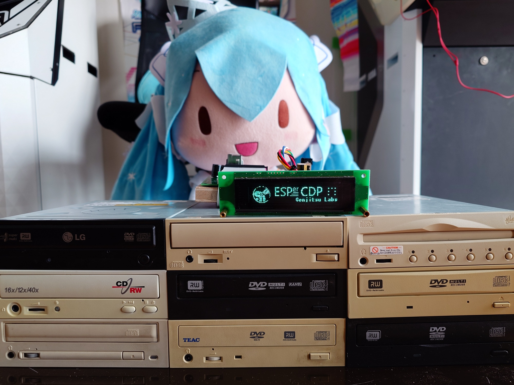

# ESPer-CDP

## Source code

[Github](https://github.com/vladkorotnev/cd-player)

## Overview

* Videos (rev1): [English](https://youtu.be/To1woYCxPkw)・[русский](https://youtu.be/jMiKXZWBPP4)
* Articles: [русский](https://habr.com/ru/companies/timeweb/articles/883772)・[日本語](https://elchika.com/article/990b4118-5500-4a74-9186-8e1c0df4c5e3/)

## System Requirements

* ESPer-CDP platform dev board with IDE bus
* ESP32-WROVER **with ESP32 REV 3 or newer**, with 8MB QIO Flash and 4MB QIO PSRAM (HIMEM is not used currently)
* ESPer Keypad
* Futaba GP1232A02 VFD display (take it out of a broken arcade cabinet... or write a driver for something less obscure, but preferably also VFD :-)
* IR remote receiver + PS2 DVD remote
* optional: Nixierator module for track # display (not yet implemented)

### Tested CD drives

#### The Good

* **Recommended: NEC ND-3500A**: just works in every aspect, and even has CD TEXT! Wish every one of the others was like this.
* *Philips/Lite-On DH-20A4P* aka *Buffalo DVSM-XE1219FB*: Load a bit on the slow side, noisy mech! Janky ffwd/rewind (using software timer because the drive doesn't do SCAN commands).
* *MATSHITADVD-RAM SW-9583S*: Works mostly. No SPDIF output even though the jack is there?? Do we need to alter the Mode Select page?
* *TEAC DV-W58G*: works and reads CD TEXT, janky ffwd/rewind (same as DH-20A4P). Most of the initial development was done with this drive. SPDIF output noisy during initial spin-up and pause release, or my unit just too old/faulty?
* *Matsushita SR-8171 (slimline)*: mostly works. TOC read after disc change is unstable (goes through on 3rd retry, timing/busyflag issue?) Needs a standard JAE 50pin to IDE 40pin adapter. Does not require 12V supply. Analog output only.

#### The Bad

* *Matsushita/Panasonic SW-9590C*: never initializes, never sets DRQ, faulty unit?

#### The Ugly

* *NEC CDR-1400C*: kinda works, very unstable state management, sometimes freezes the whole system, doesn't report media type codes properly.
* *TEAC CD-C68E*: works including changer, sometimes TOC reads are broken, workaround is in place but still. *No SPDIF output, so you have to resort to analog.* As of V1.0a it's become significantly more glitchy and I have no idea why. TBD in a future release...
* *ALi DVD Ver0.96A_0104*: found inside a MUSTEK DVD player. Plays it seems but no SPDIF. Cannot stop without being paused first. Overall weird behavior.

## Capabilities

* Read CD audio TOC from an IDE drive
* Ask the drive to play/pause and skip tracks (sequential playback only for now)
* Read CD TEXT if the drive supports it (only English/UTF8 block is supported)
* Display CD metadata found online through [Musicbrainz](https://musicbrainz.org/), or [GnuDB](https://gnudb.org/) — using real [libcddb](lib/cddb) ported to ESP32, lol
* Cache CD metadata in Flash (no cleanup when storage runs out yet... but with compression you can fit an average CD collection in there with ease)
* Display timed lyrics for the songs using the awesome [LRCLib](https://lrclib.net/)
* Receive internet radio stations (as long as no crazy bitrate) in MP3 and AAC formats with up to 6 station presets
* Receive sound over Bluetooth (SBC only) and control the remote device
* Settings UI on screen with multiple language support: English, Japanese, Russian, feel free to add your own?
* IR Remote (PS2-DVD remote)
* Scrobbling to Last.FM

## Credits

* Thanks to OBIWAN for help with the GP1232A02 protocol
* Thanks to [Phil Schatzmann](https://www.pschatzmann.ch/) for [Arduino Audio Tools](https://github.com/pschatzmann/arduino-audio-tools) and helping troubleshoot it's usage in the project
* Fonts `keyrus08x08`, `keyrus08x16` yanked from the MS-DOS Russian Locale package "keyrus" by Dmitriy Gurtyak &copy; 1989-1994
* Font `xnu` yanked from the [XNU/Darwin kernel](https://github.com/apple/darwin-xnu/blob/main/osfmk/console/iso_font.c), &copy; 2000 Apple Computer, Inc., &copy; 2000 Ka-Ping Yee
* [Misaki Mincho](https://littlelimit.net/misaki.htm) 8x8 kanji font, [k8x12](https://littlelimit.net/k12x8.htm) kanji font by [門真 なむ (LittleLimit)](https://littlelimit.net/index.html)
* Inspired by [ATAPIDUINO](http://singlevalve.web.fc2.com/Atapiduino/atapiduino.htm) and [daniel1111's ArduinoCdPlayer](https://github.com/daniel1111/ArduinoCdPlayer)

## Why does this domain exist?

This domain is used for automatic firmware update distribution by building them in CI and publishing them via Github Pages :P

----

&copy; Genjitsu Gadget Lab, 2025 (yes, a CD player project in 2025)